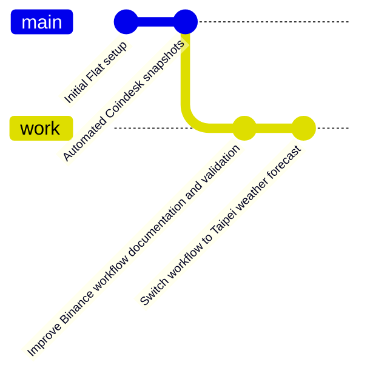
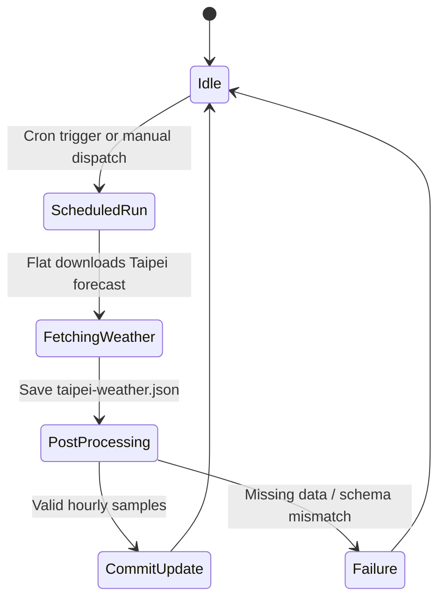
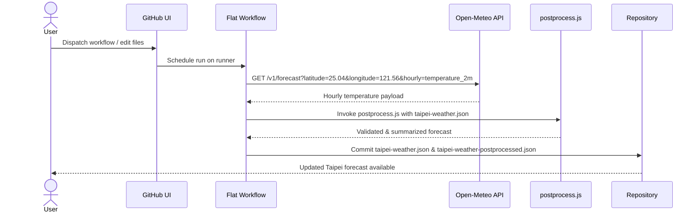
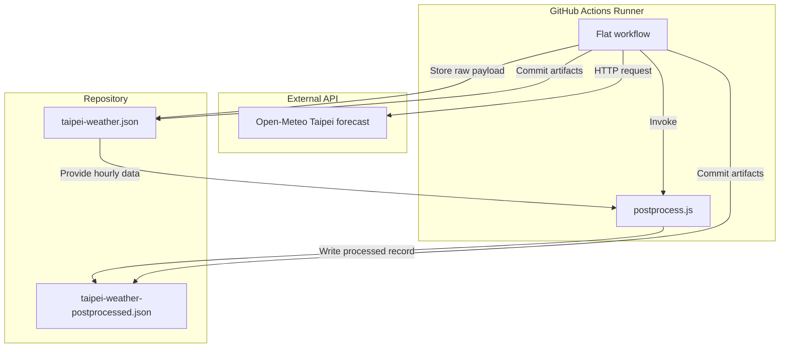
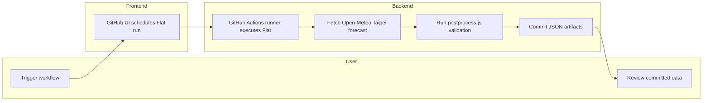

# Flat Data Demo - Taipei Weather

## Visual Repository Overview

### Git History


### State Diagram


### Sequence Diagram


### Architecture Diagram


### Decision Tree

```mermaid
flowchart TD
  Start([Start postprocess.js])
  CheckPayload{Payload includes hourly arrays?}
  ValidateCounts{Time & temperature lengths align?}
  ValidateValues{Entries contain valid timestamps & °C?}
  Success[[Write taipei-weather-postprocessed.json]]
  Fail[[Throw error and fail workflow]]

  Start --> CheckPayload
  CheckPayload -- No --> Fail
  CheckPayload -- Yes --> ValidateCounts
  ValidateCounts -- No --> Fail
  ValidateCounts -- Yes --> ValidateValues
  ValidateValues -- No --> Fail
  ValidateValues -- Yes --> Success
```


### Swimlane Diagram


This demo is part of a larger Flat Data project created by [GitHub OCTO](https://octo.github.com/). Read more about the project [here](https://octo.github.com/projects/flat-data).

## What this demo does

This repository uses a [Flat Data Action](https://github.com/githubocto/flat) to fetch the hourly 2 m air temperature forecast for Taipei from [Open-Meteo](https://api.open-meteo.com/v1/forecast?latitude=25.04&longitude=121.56&hourly=temperature_2m). The raw payload is committed to `taipei-weather.json`, and a summarized 24-hour slice is written to `taipei-weather-postprocessed.json`. Both files are updated every 5 minutes when the forecast changes.

> **Note:** Open-Meteo is a free, unauthenticated API. You can adjust the coordinates or parameters in `.github/workflows/flat.yml` to target a different city or weather variable.


## Using Python

While this example uses a javascript Deno file to run the postprocessing tasks, you can also use Python as specified in this example: [https://github.com/pierrotsmnrd/flat_data_py_example](https://github.com/pierrotsmnrd/flat_data_py_example). Thank you [@pierrotsmnrd](https://github.com/pierrotsmnrd)!

## Tutorial using the Github GUI

This is a super simple example of how to use Flat Data using the Github GUI. 

### Part I: Getting data into our GitHub repository

#### Setting up a Flat Data project

1. **Create a new GitHub repository**: create a new GitHub repository.

    

2. **Create a flat.yaml file inside of a .github/workflows/ folder**: You can use the GitHub GUI to create a new “flat.yaml” file inside of a very specific folder: .github/workflows/. You can create the folders by just typing out the path as you create the flat.yaml file.

    

3. **Add the following code to the flat.yaml file:**

	```yaml
	name: Flat
	
	on:
	  push:
	    paths:
	      - .github/workflows/flat.yml # Only run a new workflow every time this file (flat.yaml) file changes
	  workflow_dispatch: # Required even though this is currently empty
	  schedule:
	    - cron: '*/5 * * * *' # Run this workflow every 5 minutes
	
	jobs:
	  scheduled:
	    runs-on: ubuntu-latest
	    steps: # This workflow has 3 steps
	      # The first step is to check out the repository so it can read the files inside of it and do other operations
	      - name: Check out repo
	        uses: actions/checkout@v2
	      # This step installs Deno, which is a new Javascript runtime that improves on Node. We'll use it for postprocessing later
	      - name: Setup deno
	        uses: denoland/setup-deno@main
	        with:
              deno-version: v1.x
	      # The third step is a Flat Action step. We fetch the data in the http_url and save it as downloaded_filename
              - name: Fetch data
                uses: githubocto/flat@v3
                with:
                  http_url: https://api.open-meteo.com/v1/forecast?latitude=25.04&longitude=121.56&hourly=temperature_2m # The data to fetch every 5 minutes
                  downloaded_filename: taipei-weather.json # The http_url gets saved and renamed in our repository as taipei-weather.json
	```
	
	Let’s discuss what’s happening in a few of these lines of code:

   	a. This section tells the workflow to manually start any time that there is a change made to the flat.yaml file
   	
   	```yaml
   	push:
	    paths:
	      - .github/workflows/flat.yml
	```
	
	b. This section determines how often the Action will run. It uses a utility called [cron](https://docs.github.com/en/actions/reference/workflow-syntax-for-github-actions#onschedule) to schedule time-based jobs. Cron jobs have a very particular syntax, and in this example we’re telling the workflow to run every 5 minutes (Actions schedules run at most every 5 minutes). You can use a [handy page like this one](https://crontab.guru/) to figure out any schedule (every hour, once a month, every Saturday, etc).
	
	```yaml 
	schedule:
	    - cron: '*/5 * * * *'
	```
	
	c. Finally, we have a section for the Flat Action itself. The action takes at minimum two parameters. The `http_url` parameter specifies what endpoint or data we want the Action to download. The `downloaded_filename` specifies what to rename the downloaded data once we commit it to our repo.
	
        ```yaml
        with:
            http_url: https://api.open-meteo.com/v1/forecast?latitude=25.04&longitude=121.56&hourly=temperature_2m
            downloaded_filename: taipei-weather.json
        ```


4. **Commit the flat.yaml file:** Once you commit the flat.yaml file to your folder, you will have officially completed writing your first Github Action! GitHub Actions is a service that lets us automate all kinds of workflows in a repository by writing instructions and scripts in a YAML file. In this example our action uses another action itself, the Flat Action.


#### Running the Flat Action

1. **Launch a GitHub Action workflow:** Without doing anything, our Action will run every 5 minutes and fetch any new Taipei weather forecast data. For the sake of this tutorial, we’ll also trigger it manually so you can see the result instantly.

    Navigate to the “Actions” tab, click on the “Flat” workflow on the left hand column, click on “Run Workflow” dropdown and then button. 

    

    

2. **Check for the taipei-weather.json file:** After a few seconds you should see the taipei-weather.json file show up in your repository. It’s the same data as was in the original endpoint! 

    

3. **Check the commit history:** If you check the commit history for the repository, you’ll see that Flat Action logs when a particular file changed and was committed to your repository.

    At this point you’ve used Flat Data to get data on a schedule (in this case every 5 minutes) into your repo. Congrats! But Flat Data can do a bit more. Read on to see how you can add an extra step to process your data in more advanced ways. 

    

### Part II: Additional processing for our downloaded data

We hope you’re already starting to see how the Flat Action can be useful. It allows you to download any kind of data (JSON, CSV, images, text files, zip folders, etc.) into your repositories at a repeatable schedule. As long as what you’re fetching has a URL, it can be downloaded into a GitHub repo. 

But what if you want to process or change the data in some way before it gets added to your repository? We’ve built in a way for you to run these post-processing tasks by specifying a `postprocess` parameter. Let’s take a look at how to do that.

1. **Create a postprocess script:** Create a new file in the repository and call it postprocess.js. 

    

2. **Add code to the postprocess script:** The following code written in Javascript and using Deno (more on this in a bit) validates the Open-Meteo response and keeps the first 24 hourly temperatures in a compact summary file.

	```javascript
        // This can be a typescript file as well

        // Helper library written for useful postprocessing tasks with Flat Data
        // Has helper functions for manipulating csv, json, excel, zip, and image files
        import { readJSON, writeJSON } from 'https://deno.land/x/flat@0.0.14/mod.ts'

        // Step 1: Read the downloaded_filename JSON
        const filename = Deno.args[0] // Same name as downloaded_filename
        const json = await readJSON(filename)
        console.log(json)

        if (typeof json !== 'object' || json === null) {
          throw new Error('Unexpected Open-Meteo response: missing object payload')
        }

        const { latitude, longitude, timezone, hourly, hourly_units: hourlyUnits } = json

        if (typeof latitude !== 'number' || typeof longitude !== 'number') {
          throw new Error('Unexpected Open-Meteo response: missing coordinates')
        }

        if (!hourly || typeof hourly !== 'object') {
          throw new Error('Unexpected Open-Meteo response: missing hourly forecast')
        }

        const times = Array.isArray(hourly.time) ? hourly.time : []
        const temperatures = Array.isArray(hourly.temperature_2m) ? hourly.temperature_2m : []

        if (!times.length || !temperatures.length) {
          throw new Error('Unexpected Open-Meteo response: hourly arrays are empty')
        }

        const forecastLength = Math.min(times.length, temperatures.length, 24)

        if (forecastLength === 0) {
          throw new Error('Unexpected Open-Meteo response: no overlapping hourly entries')
        }

        const forecast = []
        for (let index = 0; index < forecastLength; index += 1) {
          const time = times[index]
          const temperature = temperatures[index]

          if (typeof time !== 'string' || !time.length) {
            throw new Error(`Unexpected Open-Meteo response: missing time at index ${index}`)
          }

          if (typeof temperature !== 'number' || !Number.isFinite(temperature)) {
            throw new Error(`Unexpected Open-Meteo response: missing temperature at index ${index}`)
          }

          forecast.push({ time, temperatureC: temperature })
        }

        const processed = {
          location: 'Taipei, Taiwan',
          coordinates: { latitude, longitude },
          timezone: typeof timezone === 'string' && timezone.length ? timezone : 'UTC',
          hourlyUnit: typeof hourlyUnits === 'object' && hourlyUnits !== null && typeof hourlyUnits.temperature_2m === 'string'
            ? hourlyUnits.temperature_2m
            : '°C',
          forecast,
          fetchedAt: new Date().toISOString(),
          source: 'https://api.open-meteo.com/v1/forecast?latitude=25.04&longitude=121.56&hourly=temperature_2m'
        }

        // Step 3. Write a new JSON file with our filtered data
        const newFilename = `taipei-weather-postprocessed.json` // name of a new file to be saved
        await writeJSON(newFilename, processed) // create a new JSON file with the processed forecast
        console.log('Wrote a post process file')
        ```

        ```yaml
        - name: Fetch data
                uses: githubocto/flat@v3
                with:
                  http_url: https://api.open-meteo.com/v1/forecast?latitude=25.04&longitude=121.56&hourly=temperature_2m # The data to fetch every 5 minutes
                  downloaded_filename: taipei-weather.json # The http_url gets saved and renamed in our repository as taipei-weather.json
                  postprocess: postprocess.js # A postprocessing javascript or typescript file
        ```
	

4. **Check the new postprocessed-taipei-weather.json file:** In the repository you should now see a new file containing the first 24 hourly temperature readings for Taipei.

    

5. **Remove the original downloaded data (optional):** If you optionally only wanted to keep the postprocessed-taipei-weather.json file and not the original data, you can add the following lines to the postprocess script to simply delete it before it gets committed to the repository.

        ```javascript
        import { readJSON, writeJSON, removeFile } from 'https://deno.land/x/flat@0.0.14/mod.ts'
	
	const filename = Deno.args[0]
	
	…
	
	await removeFile(filename) // or await removeFile(‘taipei-weather.json’)
	```
	
	
	
💡What is Deno?💡

You might be wondering what Deno is and why the postprocess script was written in this language. Deno was created by the same engineers who wrote Node.js, but it was designed to improve on the capabilities of Node.js. Think of it as the successor to Node.js. Deno is more secure by default and does not need centralized package manager, to name just a few of it’s very handy features. 

If you know how to program with Node, Deno programming will be a breeze and extremely familiar. To get you started quickly, we’ve written a handful of examples and helper functions to get you started. Go to this repo to learn more. 


### Part III: Visualizing our data for easy sharing

For tabular data, we built a Flat Viewer app you can use to visualize your data files with a GUI. 

Check out the Flat Viewer for this repo: [https://flatgithub.com/githubocto/flat-demo-bitcoin-price](https://flatgithub.com/githubocto/flat-demo-bitcoin-price)

How to use Flat Viewer:

1. **Make sure your repository is public:** Although you can use the Flat Action with any repository — whether private or public — the Flat Viewer only works with public repositories for now.

2. **Go to the Flat Viewer URL for your repository:** all you need to do to go to the Flat Viewer is change the domain of your repository from “github.com” to “flatgithub.com”. In this example instead of using the URL: [https://github.com/githubocto/flat-demo-bitcoin-price](https://github.com/githubocto/flat-demo-bitcoin-price) we want to navigate to [https://flatgithub.com/githubocto/flat-demo-bitcoin-price](https://flatgithub.com/githubocto/flat-demo-bitcoin-price)

3. **Select ‘taipei-weather-postprocessed.json’ from the dropdown:** you should be able to see the json file data in a neat tabular format. This is a super simple file, but we provide more useful filtering and formatting features for more complex files. 

    

4. **Look at the commit history:** in the commit dropdown you can select previous versions of the file and see how the bitcoin price has changed over time. 

    

## Using the Flat Editor VSCode extension

You can also create Flat Data Action files easily with Flat Editor, a VSCode extension: [https://github.com/githubocto/flat-editor](https://github.com/githubocto/flat-editor).


## License

[MIT](LICENSE)
